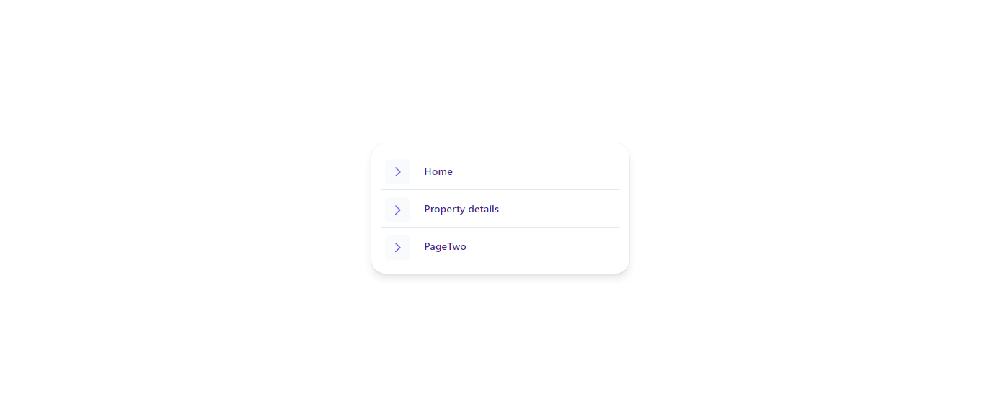
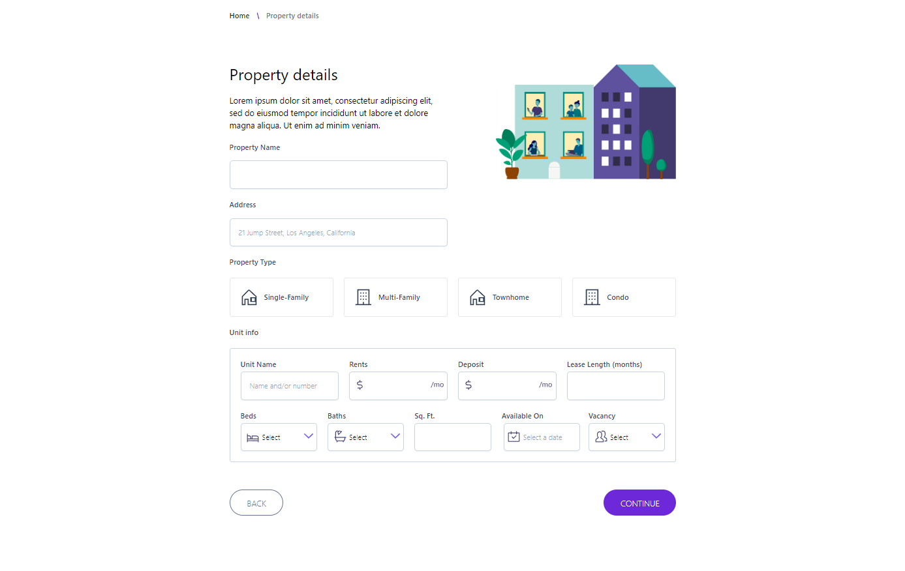
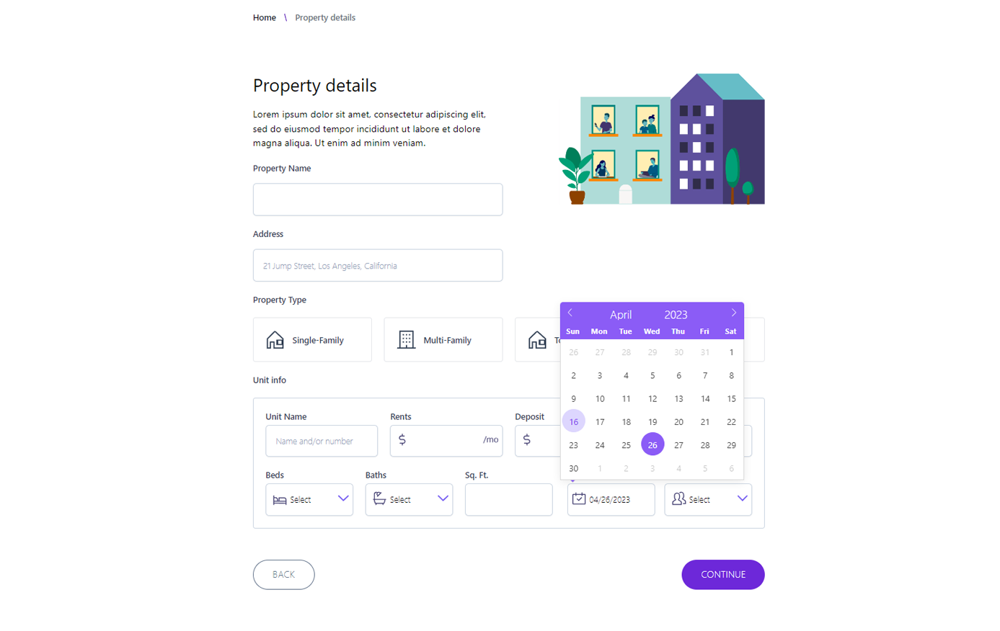
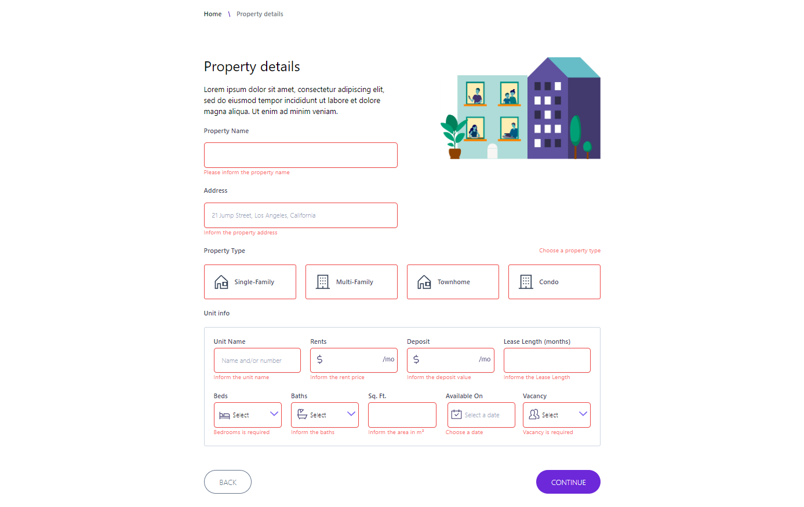
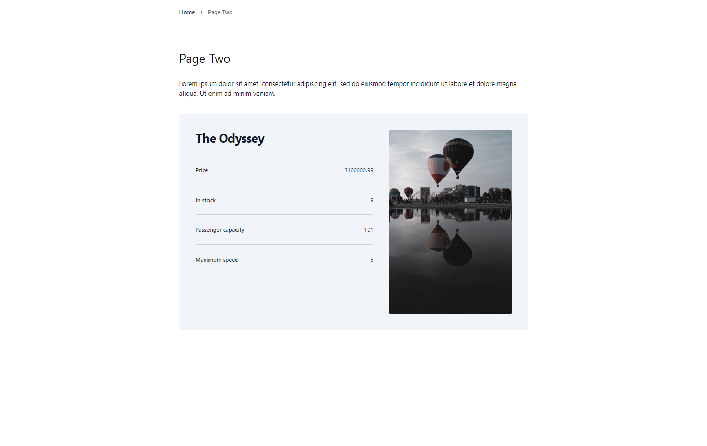

# Exercise

Please follow the README-DevEnv.md setup guide for the server until the smoke tests and unit tests are completed:
[README-DevEnv.md](https://github.com/gitricko/nameko-devex/blob/master/README-DevEnv.md)

After that, get into the gateapi/web folder, i.e.,

```
cd gateapi/web
```

Then do npm install:

```
npm install
```

Once npm install was completed, you can start the app by doing:

```
npm run dev
```

After the app started, you can view the app by opening the browser and accessing this url: http://localhost:3000

Here are the 2 tasks that you should attempt to complete in the exercise:

1. For the **Property details** page, please implement and style the page according to this [Figma mocks](https://bit.ly/3pcGsLl). For the CSS part, please only utilize tailwind css to complete this page [Tailwind CSS docs](https://tailwindcss.com/docs/installation)
2. For **Page Two** page, please call the orders API as outlined in the [API Smoke Tests](https://github.com/gitricko/nameko-devex/blob/master/test/nex-smoketest.sh) and retrieve order with id 1 and display response from the API on the page.

# Observations

Here are some of my notes on the process of this challenge

## Updating the Project

After cloning the project repository on Github, I tried to run the commands to run the project locally but got some errors.

So I googled for a solution and found the Svelte Society vídeo about the Svelte Kit migration and watched it. In the video, I saw they are using a tutorial on the Netlify website with instructions to fix the issues.

There are the steps that I followed:

- Install Vite as dev dependencies
- Remove the method override object in the svelt config file
- Replace the build/dev/preview commands in the package.json file to use Vite
- Add the Vite config file
- Run the migration command "npx svelte-migrate routes" to fix the name of the route project files
- Update the rest of the packages to fix potential security issues
- Add the CROSS ENV to handle the API request from both the DEV or PROD

### References:

- [Migration article on Netlify](https://www.netlify.com/blog/migrating-breaking-changes-in-sveltekit)
- [Svelte Society tutorial](https://www.youtube.com/watch?v=vzeZskhjoeQ)

## The Challenge:

Here I will describe all the changes I made to the project to achieve the goal of this challenge.

### Home Page



I changed a little the home page layout.

I just created a new menu (positioned in the middle of the page) because the old menu was odd and not friendly.

### Property Page:



I started this part of the challenge by creating a component and icon folder and configuring both paths with an alias on the Svelte Kit config.

After that, I created all the form inputs inside the component pages to reuse them on the page. All the input fields are bonded to a variable to help with the submission (not developed in this challenge).

To create the date picker field, I used the `flatpickr` package since that was the best option that I found to use with the tailwind.



I had never developed with Svelte, so I wanted to try a little to see how things work in this stack, so I decided to use a FORM lib to handle the form data and the validations. I choose the `svelte-forms-lib` with `YUP` to form validation.



### API Fetch Page

I create a simple page to show the API response.

Since the response gives me an object very similar to one product, I have developed the layout as a page to see the product details.

Here is the page layout (with an illustrative image):



I started this part of the challenge by adding a proxy config to the Vite config file to handle possible CORS issues, so the new localhost project URL is on port 3000.

I researched how to handle the fetch with Svelte and found an interesting [video](https://www.youtube.com/watch?v=EQy-AYhZIlE) about this matter. I decided to use `+page.ts` to get the data.

```ts
import { error } from '@sveltejs/kit'
import type { ProductResponse } from './interface'

export async function load({ fetch }) {
	const PORT = process.env.NODE_ENV === 'development' ? '3000' : '4173'

	const fetchResponse = async () => {
		let product: ProductResponse
		const url = `http://localhost:${PORT}/orders/1`
		const productResponse = await fetch(url)

		if (!productResponse.ok) {
			throw error(
				productResponse.status,
				`HTTP error! status: ${productResponse.status}`
			)
		}

		product = await productResponse.json()
		return product
	}

	return {
		product: fetchResponse(),
	}
}
```

I also decided to create a `+error.svelte` page to handle the errors with the connection to the API.
